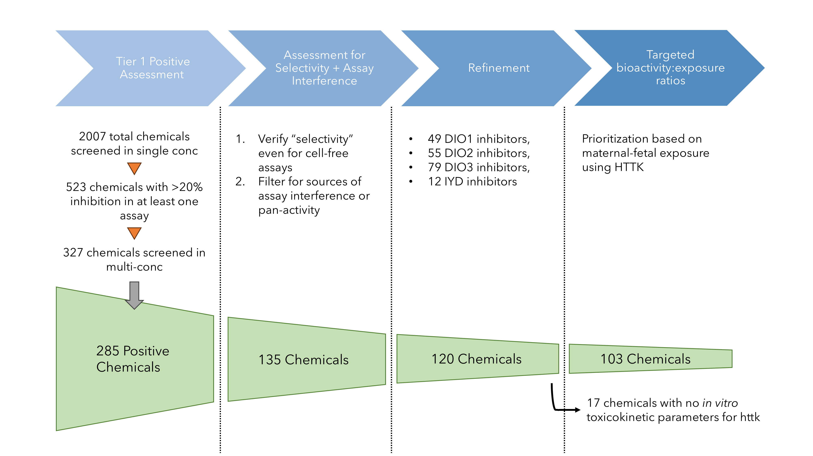

## Interpretation of thyroid-relevant bioactivity data for comparison to _in vivo_ exposures: A prioritization approach for putative chemical inhibitors of _in vitro_ deiodinase activity
### Kimberly T.Truong, John F. Wambaugh, Dustin F. Kapraun, Sarah E. Davidson-Fritz, Stephanie Eytcheson, Richard Judson, Katie Paul Friedman 

This repository contains all the necessary code and data files to reproduce figures and tables in the manuscript as well as replicate the prioritization workflow, as described in Figure 1 shown here:

The code in this repository can be used to run the prioritization pipeline, from left to right, on your own (see [Usage for running the prioritization workflow from ToxCast data](#usage-for-running-the-prioritization-workflow-from-toxcast-data)). However, it's also possible to simply generate the figures in the manuscript without having to generate the underlying data from scratch (see [Usage for generating figures using preprocessed data from workflow](#usage-for-generating-figures-using-preprocessed-data-from-workflow)). 

### Data Overview 
Scripts in the `scripts` directory reference source files in the `data/` folder. Because this work relies on many data sources, we highlight the major ones here:
1. High-throughput screening (HTS) data: concentration-response profiling data on thyroid-related endpoints for thousands of chemicals from the US EPA's ToxCast program (`data/invitrodb_v3_5_thyroid_data.RData`)
2. High-throughput toxicokinetic (HTTK) information for tens of thousands of chemicals available in the *httk* R package (will be available in version v2.6.0 on CRAN)
3. High-throughput exposure predictions representing the median of total US population aggregate exposures from all exposure pathways considered, available for almost 700k substances from the ExpoCast SEEM3 model (`data/chem.preds-2018-11-28.RData`)
4. _In vivo_ toxicity information from repeat-dose studies for over 7000 substances summarized from the US EPA's ToxValDB v9.4 (`data/toxval pods chemical level oral mgkgday.xlsx`). 

### Usage for generating figures using preprocessed data from workflow
If you'd rather not spend the time needed to process the data and run the HTTK models, I've included most of the numeric outputs in the `data/invitrodb_v3_5_deiod_filtered_httk.RData` object. Complete enrichment analysis could be reproduced with _in vitro_ data from ToxCast as input without taking too much time (~2 minutes) by knitting `Supp3_Enrichment_Analysis.Rmd` within the `supplement/` subfolder of `scripts/`. Otherwise, all other scripts for generating the main figures in the manuscript are found in the `scripts/` directory. 

Details with regards to reproducing individual figures are as follows:

**Figures 4 and 5**: knit `scripts/supplement/Supp3_Enrichment_Analysis.Rmd` (R chunks responsible for generating Figures 4 and 5 are noted). 

Figures 6-11 are mostly mapped to individual R files in the `scripts` directory as follows:

**Figure 6**: `model_stitching.R` (self-contained)

**Figure 7**: `critical_times.R` 

**Figure 8**: `is_Cplasma_protective.R`

**Figures 9-10**: Knit `Truong_etal_Full_Gestational_IVIVE.Rmd` with `execute.vignette = FALSE`

**Figures 11**: `devtox_pods.R` (self-contained)

For Figures 7-8, one can just run the plotting sections noted in the corresponding scripts by doing `Ctrl + Alt + T`. Figures 1-3 were made in Powerpoint. 

### Usage for running the prioritization workflow from ToxCast data
If you're interested in replicating the prioritization pipeline from top to bottom, the steps are as follows:
1. Run/knit `src/invitrodb_v3_5_data.Rmd` for ToxCast data retrieval from invitrodb v3.5.
2. Run `scripts/deiod_invitrodb_v3_5_processing.R` which carries out the ToxCast data filtering (see "Assessment for Selectivity + Assay Interference" and "Refinement" steps of the workflow). 
3. Change variable `execute.vignette` to TRUE in `Truong_etal_Full_Gestational_IVIVE.Rmd` and knit or by running all the chunks in RStudio ("Targeted bioactivity:exposure ratios" of workflow). 

After running these scripts, you can proceed to make the figures in the following order: 6,7,8,11. 

### Dependencies
R library httk v2.6.0 and its relevant dependencies are required. See: https://github.com/USEPA/CompTox-ExpoCast-httk and https://cran.r-project.org/web/packages/httk/index.html
