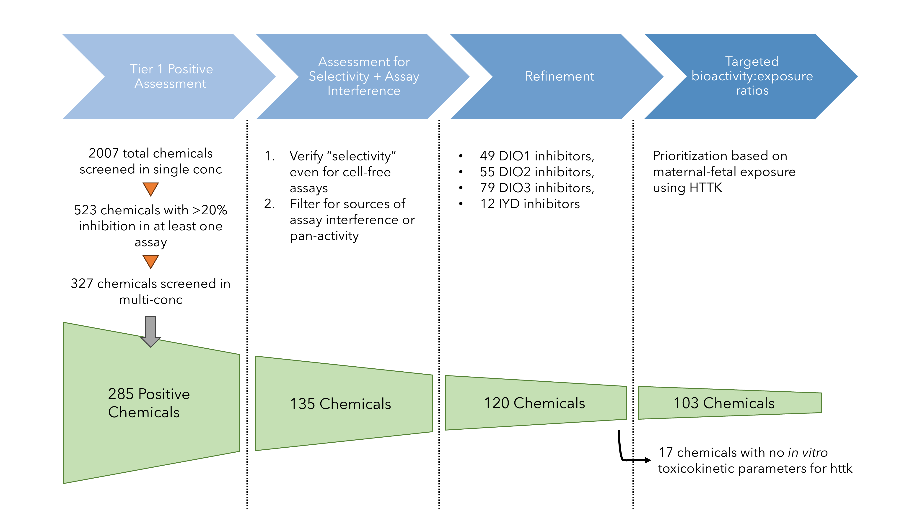

## Overview

In this vignette, we show how to use the full human gestational model from *httk* to perform *in vitro-in vivo* extrapolation (IVIVE) on a relevant *in vitro* bioactivity dataset. Briefly, this demonstrates how to take thyroid-related *in vitro* bioactivity data from ToxCast, perform IVIVE using the 3-compartment steady state model and the full human pregnancy model from *httk*, and compare it with the latest exposure estimates from ExpoCast as a method of prioritization. This is detailed in Truong et al. 2024 (in preparation). 

Truong et al. 2024 describes a prioritization workflow for thyroid-related bioactivity data related to deiodinase inhibition and applies the full human gestational model to compute administered equivalent doses (AEDs) and bioactivity-to-exposure ratios (BERs) by integrating SEEM3 ExpoCast predictions. The figure below shows an overview of the workflow. 

{width=100%}

This vignette covers the last step of the workflow "Targeted bioactivity:exposure ratios", and the previous three steps are done by executing `deiod_invitrodb_v3_5_processing.R`.

This vignette reproduces Figures 9 and 10 from Truong et al. 2024.

## HTTK Version 
This vignette was created with httk v2.5.0 (with new model functionality). 

```{r configure-knitr, include = FALSE}
# this runs on my local but this would have to be changed to the path of the dir you git cloned to
knitr::opts_knit$set(root.dir = 'C:/Users/ktruong/OneDrive - Environmental Protection Agency (EPA)/Profile/Documents/CompTox-thyroid-httk')
options(rmarkdown.html_vignette.check_title = FALSE)

```

## Data Import 
We need to load in the processed *in vitro* bioactivity data. This was done by `deiod_invitrodb_v3_5_processing.R`, and results were saved in the `./data/invitrodb_v3_5_deiod_filtered_httk.RData` object.

```{r invitro-data}
rm(list = ls())
load('./data/invitrodb_v3_5_deiod_filtered_httk.RData', verbose = TRUE)

```
### eval = execute.chunk 
Several chunks of code in this vignette have "eval = execute.chunk" and we set execute.chunk to be FALSE, by default. We do this to include all the code that was necessary to produce the figures but was not run when the vignette was built since some of these chunks take a considerable amount of time. You can still reproduce the end figures knitting the .Rmd file, since all the necessary and intermediate data objects are stored in `./data/invitrodb_v3_5_deiod_filtered_httk.RData`. If you want to rerun the whole workflow on your own, you must rerun all code from top to bottom, either by changing execute.chunk to TRUE or click on the "green arrow" in RStudio. 

```{r}
execute.chunk <- FALSE 
```

### Load libraries 
```{r libraries, message = FALSE}
library(httk)
library(data.table)
library(dplyr)
library(openxlsx)
library(ggpubr)
library(cowplot)
library(ggrepel)
library(latex2exp)
library(viridis)
library(scales)

```

# IVIVE using 3-compartment steady state model

## Examine Chemicals
Only 50 chemicals have experimental toxicokinetic (TK) parameters sufficient for *httk*. 
```{r exp-TK-chems, warning = FALSE}
# how many chems had experimental TK params?
human.data.pre <- subset(get_cheminfo(info = 'all', species = 'Human', 
                                      model = '3compartmentss'), 
                         DTXSID %in% ac50.dt$dsstox_substance_id)  

nrow(human.data.pre)

```

### In silico predictions of TK parameters
We need to supplement these with *in silico* predictions of TK parameters.
```{r insilico-preds, message=FALSE, warning=FALSE}
# predict Clint/fup values for missing chems 
# this loads new chem.physical_and_invitro.data table into the global env 
load_dawson2021() # most data for ToxCast chems
load_sipes2017() # most data for pharma compounds 
load_pradeep2020() # best ML method for in silico prediction 

```

### Examine missing chemicals 
```{r missing-chems, warning = FALSE}
human.httk.dt <- subset(ac50.dt, dsstox_substance_id %in% get_cheminfo(info = 'DTXSID', 
                                                                       species = 'Human', 
                                                                       model = '3compartmentss', 
                                                                       physchem.exclude = FALSE,  
                                                                       median.only = TRUE))
# layer class information to priority chemicals
ac50.dt$class_type <- all_dat$class_type[match(ac50.dt$dsstox_substance_id, all_dat$dsstox_substance_id)]
ac50.dt$chosen_class <- all_dat$chosen_class[match(ac50.dt$dsstox_substance_id, all_dat$dsstox_substance_id)]

missing.dtxsids <- setdiff(ac50.dt$dsstox_substance_id, human.httk.dt$dsstox_substance_id)

# a lot of PFAS dropped out (n = 13)
knitr::kable(ac50.dt[dsstox_substance_id %in% missing.dtxsids, 
                     .(dsstox_substance_id, chnm, class_type, chosen_class)], 
             row.names = T)

```

```{r tech-review-chems, eval = execute.chunk, include = FALSE}
e <- new.env(parent = emptyenv())
(load('./data/invitrodb_v3_5_deiod_filtered_httk.RData', envir = e))

# these (98) chems were used in coauthor/tech review
# one of these was a PFAS (DTXSID80379721) predicted by Dawson 2021 so should have been 97 
#human.httk.dt <- subset(ac50.dt, dsstox_substance_id %in% e$ivive.moe.tb[, dtxsid])

```

## Predicting AEDs based on Css50 (in plasma)
There are two ways to compute an oral AED in *httk*:  
1. compute a steady-state plasma concentration via `calc_mc_css` and then:
$$ 
AED = \frac{AC_{50}}{CSS_{50}}
$$
2. use `calc_mc_oral_equiv` passing the AC50 to the `conc` argument and specifying `which.quantile = c(0.5)`.  

```{r 3compss-aeds, warning = FALSE, message = FALSE, eval = execute.chunk}

for (i in 1:nrow(human.httk.dt)) {
  
  message('Calculating for chemical: ', human.httk.dt$chnm[i], '\n')
  set.seed(123)
  out <- calc_mc_css(dtxsid = human.httk.dt$dsstox_substance_id[i], 
                     species = 'Human', 
                     daily.dose = 1, 
                     which.quantile = c(0.5, 0.95), 
                     model = '3compartmentss', 
                     output.units = 'uM', 
                     parameterize.arg.list=list(physchem.exclude=FALSE), 
                     suppress.messages = TRUE) # This does not work- report bug
  
  human.httk.dt$mc.css50[i] <- out["50%"]

  set.seed(123)
  oralequiv.out <- calc_mc_oral_equiv(conc = human.httk.dt$min_ac50[i],
                                      dtxsid = human.httk.dt$dsstox_substance_id[i], 
                                      species = 'Human',
                                      which.quantile = c(0.5, 0.95),
                                      input.units = 'uM',
                                      output.units = 'mgpkgpday',
                                      model = '3compartmentss',
                                      restrictive.clearance = TRUE,
                                      parameterize.arg.list=list(physchem.exclude=FALSE),
                                      suppress.messages = TRUE)
  
   human.httk.dt$oral_equiv50[i] <- oralequiv.out["50%"]
}                                                                

human.httk.dt[, calc.aed50 := min_ac50/mc.css50]
human.httk.dt[, fold_diff50 := log10(oral_equiv50/calc.aed50)]

```

## Load ExpoCast predictions (SEEM3)
```{r seem3, eval = execute.chunk}
load("./data/chem.preds-2018-11-28.RData", verbose = TRUE)
SEEM = chem.preds 
rm(chem.preds)

message(paste("SEEM3 predictions exist for", length(unique(SEEM$dsstox_substance_id)), "chemicals", 
              sep = " "))

# let's use the aed values from the division 
human.httk.dt2 <- human.httk.dt[, c('dsstox_substance_id', 'chnm', 
                                    'DIO1', 'DIO2', 'DIO3', 'IYD', 'min_ac50', 
                                    'mc.css50', 'calc.aed50')]

# integrate SEEM3 predictions with merge
human.httk.dt2.seem3 <- merge.data.table(human.httk.dt2, 
                                         SEEM[, c("dsstox_substance_id", "seem3", "seem3.u95")], 
                                         by = c("dsstox_substance_id"), 
                                         all.x = TRUE)

human.httk.dt2.seem3[, plasmaBER50 := calc.aed50/seem3.u95]
human.httk.dt2.seem3[, log.pBER50 := log10(plasmaBER50)]

# offload memory
rm(SEEM)

ivive.moe.tb <- human.httk.dt2.seem3
setnames(ivive.moe.tb, "dsstox_substance_id", "dtxsid")

```

# IVIVE using the Full Human Gestational Model

### Compute half-lives
```{r half-lives, warning = FALSE, eval = execute.chunk}
for (i in 1:nrow(ivive.moe.tb)) {
  ivive.moe.tb$half.life[i] <- calc_half_life(dtxsid = ivive.moe.tb$dtxsid[i], physchem.exclude = FALSE) # in hrs
  ivive.moe.tb$half.life.days <- ivive.moe.tb$half.life/24 # in days
}

```

### Update RData with latest IVIVE data with half-life info
```{r add-ivive-tb, eval = execute.chunk}
# update RData file with BER_plasma data 
# this helps save some time in knitting this vignette 
e <- new.env(parent = emptyenv())
(load('./data/invitrodb_v3_5_deiod_filtered_httk.RData', envir = e))
e$ivive.moe.tb <- ivive.moe.tb
do.call("save", c(ls(envir = e),
                  list(envir = e, file ='./data/invitrodb_v3_5_deiod_filtered_httk.RData')))

```

## Simulate full-term human pregnancy model 
```{r fullpreg-sim, message = FALSE, warning = FALSE, eval = execute.chunk}

# tissues where DIO enzymes live 
impacted_tissues <- c('Cliver', 'Cthyroid', 'Cfliver', 'Cfbrain', 'Cfthyroid', 
                      'Cplacenta', 'Cconceptus', 'Cplasma')
targets <- c('DIO1', 'DIO2', 'DIO3', 'IYD')

# max conc in every tissue for every chemical
Cmax.tissues <- data.frame(matrix(NA, ncol = length(impacted_tissues) + 1, 
                                  nrow = nrow(ivive.moe.tb), 
                                  dimnames = list(NULL, c('dtxsid', impacted_tissues))))

for(i in 1:nrow(ivive.moe.tb)) {
  
  sol.out <- solve_full_pregnancy(dtxsid = ivive.moe.tb$dtxsid[i],
                            daily.dose = 1, 
                            doses.per.day = 1,
                            time.course = seq(0, 40*7, 1/24), # view solution by hour
                            track.vars = impacted_tissues, 
                            physchem.exclude = FALSE)

  
  # get max of every column re: compt 
  Cmax.tissues[i, impacted_tissues] <- apply(sol.out[, impacted_tissues], 2, max, na.rm = T)
  Cmax.tissues[i, 'dtxsid'] <- ivive.moe.tb$dtxsid[i]
  
}

```

## Calculate AEDs by Target and Tissue
```{r preg-aeds, eval = execute.chunk}
tissue.aeds <- list()

# tissues specific for each target 
tissue_list <- list(DIO1 = c('Cliver', 'Cfliver', 'Cthyroid', 'Cfthyroid', 'Cconceptus'), 
                    DIO2 = c('Cthyroid', 'Cfthyroid', 'Cfbrain', 'Cconceptus'), 
                    DIO3 = c('Cthyroid', 'Cfthyroid', 'Cfbrain', 'Cplacenta', 'Cconceptus'), 
                    IYD = c('Cthyroid', 'Cfthyroid', 'Cconceptus'))

for (i in names(tissue_list)) {
  active.chem.ind <- which(!is.na(ivive.moe.tb[, ..i]))
  n.chems <- length(active.chem.ind)
  
  empty.mat <- matrix(NA, nrow = n.chems, ncol = length(tissue_list[[i]]) + 1)
  df.target <- data.frame(empty.mat)
  colnames(df.target) <- c('dtxsid', tissue_list[[i]])
 
  df.target[, 2: (length(tissue_list[[i]])+1) ] <- mapply(function(x,y) x/y, ivive.moe.tb[active.chem.ind, ..i], Cmax.tissues[active.chem.ind, tissue_list[[i]]])
  
  df.target$dtxsid <- ivive.moe.tb$dtxsid[active.chem.ind]
  tissue.aeds[[i]] <- df.target
}

```

### Update RData file with tissue-based AEDs
```{r preg-aeds-RData, eval = execute.chunk}
e <- new.env(parent = emptyenv())
load('./data/invitrodb_v3_5_deiod_filtered_httk.RData', envir = e)
e$tissue.aeds <- tissue.aeds
do.call("save", c(ls(envir = e), list(envir = e, file ='./data/invitrodb_v3_5_deiod_filtered_httk.RData')))

```

## Figure 9: Priority Chemicals based on maternal-fetal BERs

```{r fig9-wrangling, eval = execute.chunk}
impacted_tissues <- c('Cliver', 'Cthyroid', 'Cfliver', 'Cfbrain', 'Cfthyroid', 
                      'Cplacenta', 'Cconceptus', 'Cplasma')

get_ber_data <- function(name, df) {
  
  df$exposure <- ivive.moe.tb$seem3.u95[match(df$dtxsid, ivive.moe.tb$dtxsid)]
  df.m <- df %>% select(-exposure) %>%
    reshape2::melt(id.vars = c('dtxsid'), 
                   variable.name = 'compt', value.name = 'aed')
  df.m$exposure <- ivive.moe.tb$seem3.u95[match(df.m$dtxsid, ivive.moe.tb$dtxsid)]
  df.m$ber = df.m$aed/df.m$exposure
  df.m2 <- df.m %>% 
    select(-exposure) %>%
    reshape2::melt(id.vars = c('dtxsid', 'compt', 'ber'))
  
  # add melted ExpoCast data as rows for each unique chem 
  expocast.dat <- df %>% select(dtxsid, exposure) %>% 
    reshape2::melt(id.vars = c('dtxsid'))
  
  df.m2 <- bind_rows(df.m2, expocast.dat)
  df.m2$value <- log10(df.m2$value)
  df.m2$ber <- log10(df.m2$ber)
  df.m2$chnm <- ivive.moe.tb$chnm[match(df.m2$dtxsid, ivive.moe.tb$dtxsid)]
  df.m2$enzyme <- name
  return(df.m2)
}

new.list <- Map(get_ber_data, names(tissue.aeds), tissue.aeds)
ggdata = bind_rows(new.list) 
setDT(ggdata)

# order chemicals within each enzyme group by the most sensitive tissue/lifestage BER
ggdata[, min_ber := min(ber, na.rm = TRUE), keyby = .(enzyme, dtxsid)]
ggdata <- ggdata[order(min_ber), .SD, keyby = .(enzyme)]

# exposure values are dependent on dtxsid not httk compt 
ggdata[variable == 'exposure', compt := 'exposure']

# make a deep copy or else it will be modified by reference 
tissue.bers <- copy(ggdata)

# round all numerical values including BERs to 2 sigfigs 
num.cols <- c("value", "ber", "min_ber")
tissue.bers[, c(num.cols) := lapply(.SD, signif, digits = 2), .SDcols = num.cols]

```

```{r fig9-plt}
min_val <- tissue.bers[min_ber <= 3, min(value), by = enzyme][, min(V1)]
max_val <- tissue.bers[min_ber <= 3, max(value), by = enzyme][, max(V1)]
ylims <- c(min_val, max_val)

# generate a set of 3 viridis colors for lifestage 
# yellow represents neither maternal or fetal, i.e., conceptus
my_viridis_colors <- viridis(n = 3)

listgg <- list()
for(k in names(tissue.aeds)) {
  
  aeds <- tissue.bers[enzyme == k & ber <= 3]
  chems <- tissue.bers[enzyme == k & ber <= 3, dtxsid]
  exposures <- tissue.bers[enzyme == k & variable == "exposure" & dtxsid %in% chems]
  
  listgg[[k]] <- ggplot(data = rbind(aeds,exposures), 
                        mapping = aes(x = reorder(chnm, -min_ber), 
                                      y = value)) +
    geom_point(aes(shape = compt, color = compt), 
               alpha = 0.65, size = 3, stroke = 1.15, 
               show.legend = T) +
    scale_y_continuous(breaks = seq(ylims[1], ylims[2], 1),
                       limits = ylims) +
    scale_shape_manual(name = "Compartment corresponding to AED \n or Exposure", 
                       labels = c("maternal liver", "fetal liver", 
                                  "maternal thyroid", "fetal thyroid", 
                                  "conceptus", 
                                  "fetal brain", 
                                  "placenta", "exposure"),
                       values = c('Cfbrain' = 19,
                                  'exposure' = 18, 
                                  'Cliver' = 17,
                                  'Cfliver' = 17, 
                                  'Cplacenta' = 15, 
                                  'Cthyroid' = 8,
                                  'Cfthyroid' = 8, 
                                  'Cconceptus' = 6), 
                       drop = F) + # this makes sure all levels of a factor are displayed even if unused 
    scale_color_manual(name = "Compartment corresponding to AED \n or Exposure", 
                       labels = c("maternal liver", "fetal liver", 
                                  "maternal thyroid", "fetal thyroid", 
                                  "conceptus", 
                                  "fetal brain", 
                                  "placenta", "exposure"),
                       values = c('Cfbrain' = my_viridis_colors[2],
                                  'exposure' = 'dimgrey', 
                                  'Cliver' = my_viridis_colors[1],
                                  'Cfliver' = my_viridis_colors[2], 
                                  'Cplacenta' = 'pink', 
                                  'Cthyroid' = my_viridis_colors[1],
                                  'Cfthyroid' = my_viridis_colors[2], 
                                  'Cconceptus' = my_viridis_colors[3]), 
                       drop = F) +
    labs(x = 'Chemical', y = 'Oral AED or Exposure (log10 mg/kg-bw/day)', title = k) +
    theme_bw() +
    theme(legend.position = "none", 
          plot.title = element_text(size = 18, face = "bold"), 
          axis.title = element_text(size = 16), 
          axis.text = element_text(size = 14), 
          legend.text = element_text(size = 14), 
          legend.title = element_text(size = 13, hjust = 0.5)) +
    coord_flip()
}

# remove extra axis labels 
listgg$IYD <- listgg$IYD + labs(x = '', y = '')
listgg$DIO3 <- listgg$DIO3 + 
  labs(x = '') 
listgg$DIO1 <- listgg$DIO1 + labs(y = '')

# arrange DIO1 and DIO2 with equal sizes since they have 14 chems each
pcol1 <- plot_grid(listgg$DIO1, listgg$DIO2, 
                  align = "hv", nrow = 2)

# make DIO3 3x taller than IYD (30 chems vs 3)
pcol2 <- plot_grid(listgg$IYD, listgg$DIO3, 
                   align = "hv", nrow = 2, 
                   rel_heights = c(1,3))

# combine two columns of plots
prow <- plot_grid(pcol1, pcol2, 
                    align = "h", ncol = 2, 
                    rel_widths = c(1,1))

grobs <- ggplotGrob(
  listgg$DIO2 + 
  guides(
    shape = guide_legend(ncol = 2, byrow = F), 
    color = guide_legend(ncol = 2, byrow = F)
  ) +
  theme(legend.position = "bottom")
  )$grobs
legend2 <- grobs[[which(sapply(grobs, function(x) x$name) == "guide-box")]]

# add the legend underneath the plots; make it 10% of the height of the combined plots
fig9 <- plot_grid(prow, legend2, 
          nrow = 2, rel_heights = c(1,0.1))

ggsave(plot = fig9,
       units = "in",
       dpi = 300,
       width = 21.33, height = 13,
       device = "tiff",
       filename = "./figures/300dpi/preg_prioritization_by_BER-v3.tiff")

ggsave(plot = fig9,
       units = "in",
       dpi = 300,
       width = 21.33, height = 13,
       device = "png",
       filename = "./figures/preg_prioritization_by_BER-v3.png")

```

### update RData File with maternal-fetal BERs
```{r mat-fet-bers-Rdata, eval = execute.chunk}
# update RData file with melted data for ggplot
# i.e. chemicals ranked by the most sensitive tissue and lifestage-specific BERs with exposure estimates from ExpoCast
e <- new.env(parent = emptyenv())
load('./data/invitrodb_v3_5_deiod_filtered_httk.RData', envir = e)
e$tissue.bers <- tissue.bers
do.call("save", c(ls(envir = e), list(envir = e, file ='./data/invitrodb_v3_5_deiod_filtered_httk.RData')))

```

# Comparing IVIVE models based on BER prioritization 

## Table 7 
```{r table-7, warning = FALSE}
targets <- c('DIO1', 'DIO2', 'DIO3', 'IYD')

# DATA WRANGLING
tissue.bers[min_ber == ber, most_sensitive_tissue := compt]

# table matching order of chemicals in enzyme subplots with all calculated BERs
# every enzyme x chem x min BER constitutes a row 
minber.by.chem <- tissue.bers[!is.na(most_sensitive_tissue), 
                       .(chnm, min_ber, most_sensitive_tissue), by = .(enzyme, dtxsid)]

# check if there are multiple most-sensitive tissues per chem in each enzyme group 
minber.by.chem[, if(.N > 1) .SD, by = .(enzyme, dtxsid)][, length(unique(dtxsid))] #63 chems

# collapse multiple most-sensitive tissues per chem in each enzyme group
min.ber.reduced <- minber.by.chem[, most_sensitive_compts := paste(most_sensitive_tissue, collapse = ", "), by = .(enzyme, dtxsid)][, .(chnm, min_ber, most_sensitive_compts), by = .(enzyme, dtxsid)]
min.ber.reduced <- unique(min.ber.reduced)

# min BER matrix
min.ber.mat <- dcast(min.ber.reduced[, 1:4], 
                     dtxsid + chnm ~ enzyme, value.var = c('min_ber'))
min.ber.mat[, min_across_enzyme := pmin(DIO1, DIO2, DIO3, IYD, na.rm = T)]
min.ber.mat <- min.ber.mat[order(min_across_enzyme)]

# find the target corresponding to the min_across_enzyme
min.ber.mat[, enzyme := mapply(function(x) targets[x], apply(min.ber.mat[, targets, with = FALSE], 1, which.min))]

# merge data on most sensitive tissues reflecting min BER 
new.ranking.tissues <- merge.data.table(min.ber.mat, 
                                 minber.by.chem[, .(dtxsid, chnm, enzyme, min_ber, most_sensitive_tissue)], 
                                 by = c('dtxsid', 'chnm', 'enzyme'), 
                                 all.x = TRUE)
setnames(new.ranking.tissues, old = 'enzyme', new = 'target_min')

# round all BERs to 2 sigfigs for easy table viewing 
ranked.by.plasma <- ivive.moe.tb[, lmoe50 := signif(log.pBER50, digits = 2)][order(lmoe50)]

final.new.ranking <- new.ranking.tissues[, -c("target_min", "min_ber")]
final.new.ranking <- final.new.ranking[order(min_across_enzyme)]

# comparing tissue BERs from full preg model with plasma BERs from 3compss model 
plasma.tissue.bers <- merge.data.table(ranked.by.plasma[, c('dtxsid', 'chnm', 'lmoe50')], 
                           final.new.ranking[, -c('chnm')], 
                           by = c('dtxsid'))

setnames(plasma.tissue.bers, old = colnames(plasma.tissue.bers)[3:8], 
         new = c('plasma_BER50', 'DIO1_BER', 'DIO2_BER', 'DIO3_BER', 'IYD_BER', 'min_BER'))

plasma.tissue.bers <- plasma.tissue.bers[order(min_BER)]
# write.xlsx(plasma.tissue.bers, "./tables/preg_vs_nonpregBERs_v3.xlsx", colnames = T)

```

### update RData File with Table 7
```{r 3compss-vs-preg-bers-Rdata, eval = execute.chunk}
# update RData with Table 7 (preg vs non-preg BERs)
e <- new.env(parent = emptyenv())
load('./data/invitrodb_v3_5_deiod_filtered_httk.RData', envir = e)
e$plasma.tissue.bers <- plasma.tissue.bers
do.call("save", c(ls(envir = e), list(envir = e, file ='./data/invitrodb_v3_5_deiod_filtered_httk.RData')))

```

## Figure 10: Understanding and Interpreting Maternal-Fetal BERs
```{r fig10}
# merge min BER with plasma BER for each chem with unique row for each row
# ignoring multiple sensitive tissues
ber.comp <- merge.data.table(ranked.by.plasma[, c('dtxsid', 'chnm', 'lmoe50')], 
                             min.ber.mat[, -c("chnm")], 
                             by = c("dtxsid"))

setnames(ber.comp, old = colnames(ber.comp)[3:8], 
         new = c('plasma_BER50', 'DIO1_BER', 'DIO2_BER', 'DIO3_BER', 'IYD_BER', 'min_BER'))

max_ber <- max(ber.comp[, c('plasma_BER50', 'min_BER')], na.rm = T)
min_ber <- min(ber.comp[, c('plasma_BER50', 'min_BER')], na.rm = T)
ber.lims <- c(floor(min_ber), ceiling(max_ber))

# theme for the next 2 figures 
my_theme <- theme_bw() +
  theme(axis.title = element_text(size = 14, face = "bold"), 
        axis.text = element_text(size = 12), 
        legend.text = element_text(size = 12))
  
preg.vs.nonpreg.pp <- ggplot(data = ber.comp, aes(x = plasma_BER50, y = min_BER)) +
  geom_point(alpha = 0.75, size = 3, 
             show.legend = T) +
  geom_abline(slope = 1, linewidth = 1, linetype = 'solid', color = "#666666") +
  geom_abline(aes(slope = 1, intercept = 1), linetype = 'longdash', color = 'grey', linewidth = 1) + # default linesize = 1
  geom_abline(aes(slope = 1, intercept = -1), linetype = 'longdash', color = 'grey', linewidth = 1) +
  geom_label_repel(aes(label = chnm),
                   data = ber.comp[abs(plasma_BER50 - min_BER) > 1 | plasma_BER50 < 0][
                     ! chnm %in% c("2-Chloro-N-phenylacetamide") # this label is a bit distracting
                   ],
                   size = 5,
                   force = 120) +
  my_theme +
  theme(legend.position = 'bottom', 
        legend.direction = 'horizontal',
        legend.title = element_blank()) + 
  scale_x_continuous(breaks = seq(ber.lims[1], ber.lims[2], 1), 
                     limits = ber.lims) +
  scale_y_continuous(breaks = seq(ber.lims[1], ber.lims[2], 1), 
                     limits = ber.lims) +
  labs(x = 'plasma BER using 3compss model', y = 'min BER across DIO/IYD targets and tissues')

# how many chems to the right of y = x?
ber.comp[plasma_BER50 > min_BER, .N] #65 chems 

# plot SEEM3 uncertainty
ivive.moe.tb$uncertainty = log10(ivive.moe.tb$seem3.u95/ivive.moe.tb$seem3)
ber.comp$uncertainty <- ivive.moe.tb$uncertainty[match(ber.comp$dtxsid, ivive.moe.tb$dtxsid)]

min.min.ber <- min(ber.comp$min_BER)
max.min.ber <- max(ber.comp$min_BER)
min.ber.lims <- c(floor(min.min.ber), ceiling(max.min.ber))
max.uncertainty <- max(ber.comp$uncertainty)

seem3pp <- ggplot(data = ber.comp, 
       mapping = aes(x = min_BER, 
                     y = uncertainty)) +
  geom_point(size = 3, alpha = 0.8) +
  geom_label_repel(aes(label = chnm),
                   data = subset(ber.comp, min_BER < 0 | uncertainty > 4),
                   force = 50,
                   size = 5) +
  my_theme +
  theme(legend.position = 'bottom', 
        legend.direction = 'horizontal',
        legend.title = element_blank()) + 
  scale_x_continuous(breaks = seq(min.ber.lims[1], min.ber.lims[2], 1), 
                     limits = min.ber.lims) +
  scale_y_continuous(breaks = seq(0, ceiling(max.uncertainty), 1), 
                     limits = c(0, ceiling(max.uncertainty))) +
  labs(x = 'min BER by Chemical', y = TeX(r'($log_{10}ExpoCast_{u95} - log_{10}ExpoCast_{med}$)'))

median(ber.comp$min_BER)
#> [1] 3.6

bers2 <- plot_grid(preg.vs.nonpreg.pp, seem3pp, 
          labels = "AUTO", label_size = 20)

ggsave(plot = bers2, 
       units = "in", 
       dpi = 300, 
       width = 18.53, height = 8.32, 
       device = "tiff", 
       filename = "./figures/300dpi/BER_uncertainty-v3.tiff")

ggsave(plot = bers2, 
       units = "in", 
       dpi = 300, 
       width = 18.53, height = 8.32, 
       device = "png", 
       filename = "./figures/BER_uncertainty-v3.png")


```


